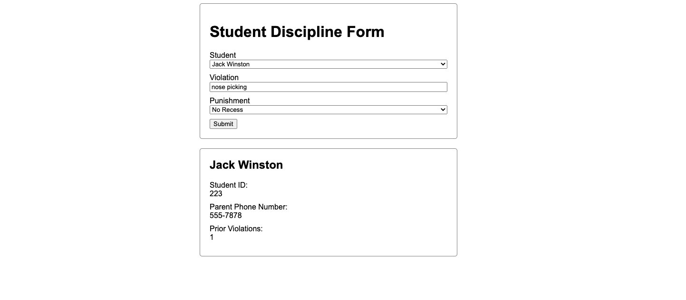

# FORM MOCK

[](./disciplineFormMock.png)

# TESTING

### Mocking Service Calls

1. Create Jasmine Spy Obj

   ```js
   const studentDisciplineServiceSpy = jasmine.createSpyObj(
     "StudentDisciplineService", // first parameter is the name of the service you want to spy/mock
     ["getStudents"] // second param is a list of the methods you want to mock
   );
   ```

1. Setup Spy

   ```js
   const student1: Student = {
     firstName: "bob",
     lastName: "ross",
     id: "111",
     parentPhoneNumber: "555-5555",
     priorViolations: 0,
   };

   const student2: Student = {
     firstName: "cindy",
     lastName: "waters",
     id: "222",
     parentPhoneNumber: "555-5555",
     priorViolations: 1,
   };

   studentDisciplineServiceSpy.getStudents.and.returnValue(
     of([student1, student2])
   );
   ```

1. Add to your providers in the TestBed, replacing your original service
   ```js
   beforeEach(async () => {
     await TestBed.configureTestingModule({
       imports: [BrowserModule, FormsModule, ReactiveFormsModule],
       providers: [
         // here
         {
           provide: StudentDisciplineService,
           useValue: studentDisciplineServiceSpy,
         },
       ],
       declarations: [StudentDisciplineComponent],
     }).compileComponents();
   });
   ```
1. Then create your test

   ```js
   it("should call getStudents from the StudentDisciplineService and set the response to the components students array property", () => {
     const expectedStudents = [student1, student2];

     expect(component.students).toEqual(expectedStudents);
   });
   ```

```

```

### Dependency Injection

[See This](https://angular.io/guide/testing-components-scenarios#final-setup-and-tests)
